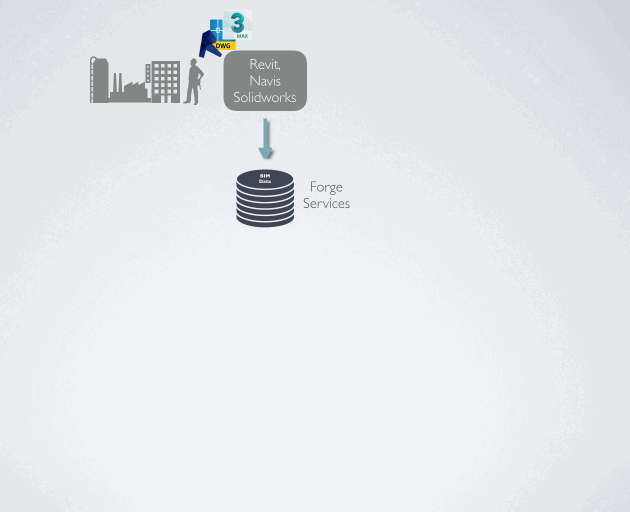

  

---
The Forge Services now support Unity ! (in beta)

Use the new "Forge AR|VR Toolkit" to help you connect into BIM/Revit/Fusion data-streams directly inside Unity.

---
Now that you have live rich BIM data, use Unity to build-out more advanced AR+VR experiences for devices like Hololens, Apple's ARKit, Vive, Oculus, DayDream and GearVR. Here's an intro to getting started:

<iframe width="640" height="480" src="https://www.youtube.com/embed/I5RBVA1Kipk" frameborder="0" allowfullscreen></iframe>

There are data-prep and query API's features too...
### Features
* mesh de-duplication and optimized instancing to reduce draw-calls and load times
* bounding box spatial queries, to only load meshes within a spatial volume
* string based queries,  to only load meshes based on meta-data

The APIs and data-prep services are the same Autodesk-Forge Services used by the web-client for BIM360 team collaboration.  So we know that fast-loading performance of large buildings as well as clash detection between versions (think git diff'ing in 3D) is now possible in Unity too.

By leveraging the Unity platform, we connect a highly specialised Unity community, into the workflows of BIM projects.  
Today, for example, a media firm would normally ask for an 'FBX' snapshot of a building from Revit, Autocad or Navisworks.  The FBX file gets out-dated as the BIM project progresses, and a new FBX file is needed.  Each time the FBX file is imported into Unity, some data-prep work is required.

This is the tradional manual data pipeline.  The Forge Toolkit is designed to remove this manual FBX approach and instead give Unity platform direct access to the Revit and Navis data flow at any stage of a BIM project.  No more FBX imports.

### Installation

See the 'Hello World' Guide on the left.

### Disclaimer

This is a beta product and not officially supported by Autodesk.

### License

MIT
